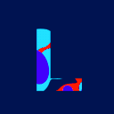

# NLP Development Team

Welcome to our repo, our NLP development team is working to provide your FiveM servers with top quality FiveM assets, improving your users' interaction with custom scripts, MLOs, outfits and peds. 

Join our community today and open a new page to yours FiveM roleplay journey!

### Our Team
<table style="border-collapse:separate; border-spacing:20px 10px;">
  <tr align="center">
    <td>
      
      
<strong style="text-align: center; font-size: 18px; text-color: #333;">leaderdak</strong>

      
Owner/Developer

    </td>
    <td>
      
      
<strong style="text-align: center; font-size: 18px; text-color: #333;">burnoutprojects</strong>

      
Developer

    </td>
  </tr>
</table>

### Our social media

